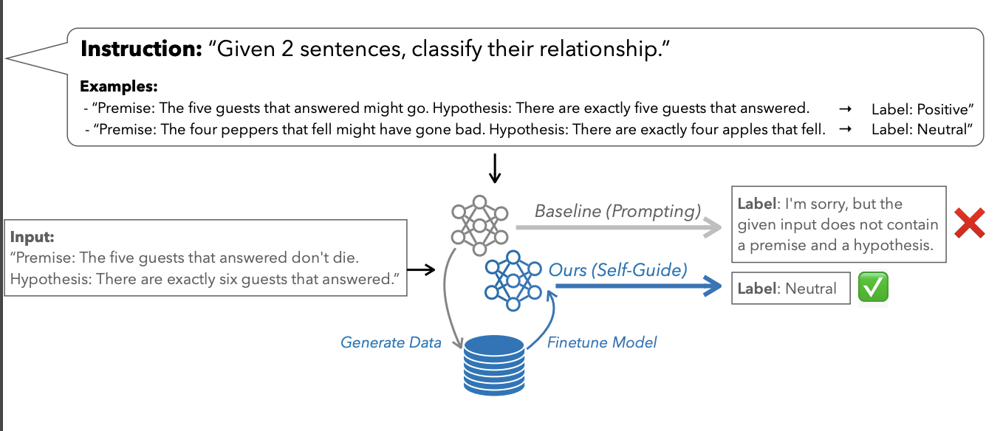

# Prompt2Model - Generate Deployable Models from Instructions

We introduce `SELF-GUIDE`, a novel methodology that enables LLMs to better execute task-specific instructions without requiring additional data or training signals. `SELF-GUIDE` operates in the few-shot setting, where we are given only a task instruction and around 3 examples of task demonstrations. `SELF-GUIDE` works by first employing the target model to generate a synthetic dataset for a given task. The model is then finetuned on this “self-generated’’ data.

## Quick Start

### Dataset

We use tasks from [NaturalInstructions V2](https://arxiv.org/abs/2204.07705). For each task, we have task instructions and example input-output pairs according to the dataset.

According to our one param fits all parameters, you could use them to self-generate the dataset and finetune the dataset to improve its performance.

Selected tasks including (The validation and test set can be accessed from the `NI_dataset` folder)
- Generation tasks: task121, task039, task036, task1195, task1345, task281, task1562, task1622
- Classification tasks: task190, task199, task200, task738, task937, task1385, task1386, task1516, task1529, task1612, task1615, task284, task329, task346

